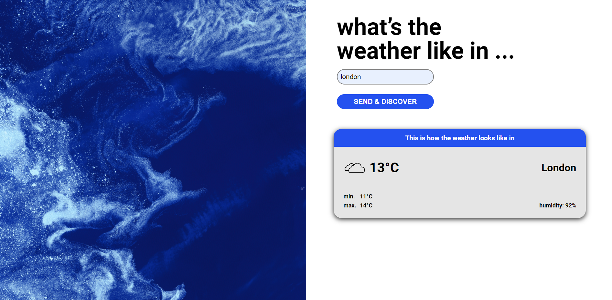

**Weatherlike-app**

<h1 align="center">
    
</h1>

<h4 align="center"> 
	🚧  Weather App ☀️☔☁️ Deployed 🚀 🚧
</h4>

 <a href="#-quick-start"> 👉 Quick Start </a> •
 <a href="#-Usage">👉 Usage</a> •
 <a href="#-technologies">👉 Technologies</a> • 
 <a href="#-author">👉 Author</a> • 

## 📋 Quick Start 

This is an study of basic javascript with [Open Weather Map API](https://openweathermap.org/api). This API access current wather data for any location inclueding over 200,000 cities.

---

## 🚀 Usage

To run this application, you need to create your own account and get you API key on [Open Weather Map API](https://openweathermap.org/api). 

---

## 🛠 Technologie

This project was build with the following technology:

- [JavaScript](https://developer.mozilla.org/pt-BR/docs/Web/JavaScript)

---

## 🦸 Autor

<a href="https://www.linkedin.com/in/gabrielafortuna/?locale=en_US">
 
  
 <b>Gabriela Dal Toé Fortuna</b></a> <a href="https://medium.com/@gabigabai" title="Medium">🚀</a>
  

---

## 📝 License

This project has the license from [MIT](./LICENSE).

Made by ❤️ por Gabriela Fortuna 👋🏽 [Let's work together!](https://www.linkedin.com/in/gabrielafortuna/?locale=en_US)

---
